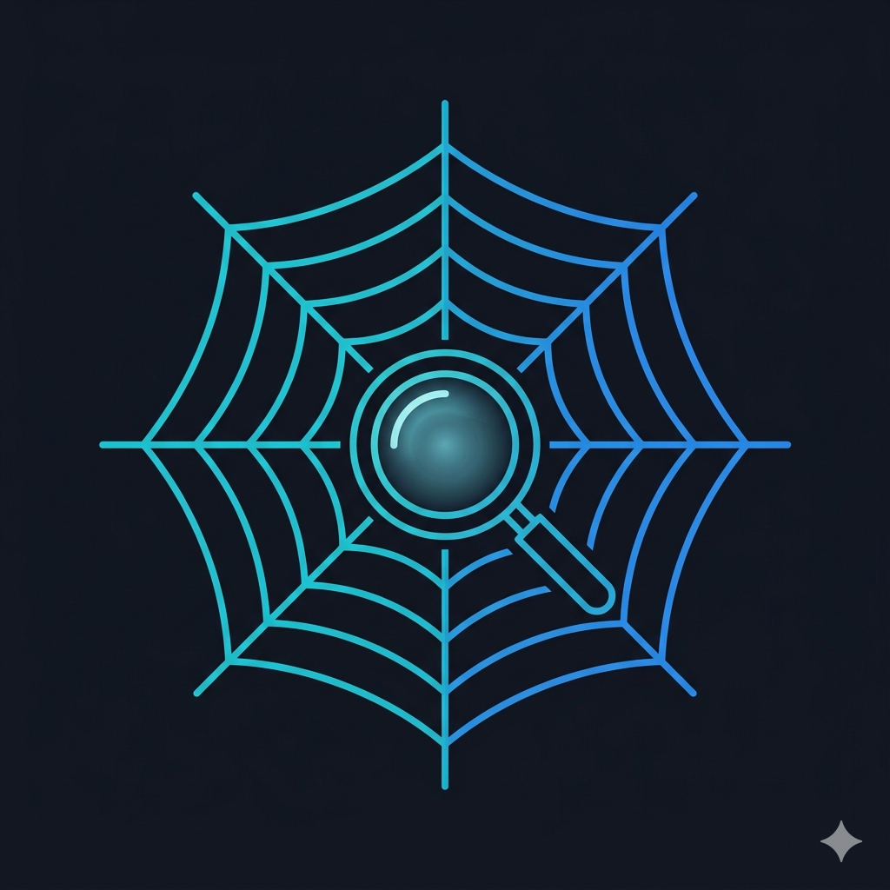

# web-search-mcp 🕸️

[](docs/web-search-mcp.png)

[](https://golang.org)
[](https://modelcontextprotocol.io)
[](LICENSE)
[](https://ollama.com)
[](https://duckduckgo.com)

**MCP server for intelligent web search — no API keys required, with local AI-powered semantic analysis running on your machine.**

---

## 💡 Why This Exists & The Magic

When an AI assistant needs to find information on the web, the typical approach is wasteful:

```
❌ BAD APPROACH (without web-search-mcp):
   AI: "find me Go trends 2025"
   → AI invokes a search engine
   → AI reads ALL pages in full
   → AI loads MEGABYTES of text into context
   → Wastes tons of tokens analyzing everything
   → Expensive, slow, inefficient
```

With **web-search-mcp** the analysis happens locally:

```
✅ GOOD APPROACH (with web-search-mcp):
   AI: "find me Go trends 2025"
   → web_search_analyze:
      ├─ DuckDuckGo → 8 URLs (0 tokens)
      ├─ chromedp + readability → clean text (0 tokens)
      └─ Ollama embedding → semantic ranking (0 tokens!)
   → AI gets: [{url, title, relevance: 66%, snippet}, ...]
   → AI PICKS only 1-2 best pages
   → AI reads ONLY their full text (few tokens)
   → Fast, cheap, intelligent
```

**The killer feature:** semantic analysis (comparing query meaning with page meaning) is done **locally via Ollama** — it consumes zero AI API tokens! The AI receives a pre-ranked list and can decide which page to read without burning through kilobytes of garbage.

---

## 🚀 Quick Start

### 1. Install dependencies

```bash
# Ollama + embedding model (required for semantic analysis)
ollama pull embeddinggemma:latest
ollama serve

# Chromium (for JavaScript-rendered pages, optional)
# Arch:  sudo pacman -S chromium
# Ubuntu: sudo apt install chromium-browser
# macOS:  brew install chromium
```

### 2. Build and run

```bash
git clone https://github.com/kirill-scherba/web-search-mcp
cd web-search-mcp
go build -o web-search-mcp .

# Start — server listens on stdin/stdout for MCP
./web-search-mcp
```

### 3. Connect to Cline

Add to your Cline MCP settings file:

```json
{
  "mcpServers": {
    "web-search-mcp": {
      "command": "/path/to/web-search-mcp",
      "args": [],
      "env": {},
      "disabled": false,
      "autoApprove": [
        "web_search",
        "web_search_analyze",
        "web_fetch",
        "web_semantic_search"
      ]
    }
  }
}
```

Then click **"Restart MCP Servers"** in the Cline panel or reload the page.

---

## 🎮 How to Use — Examples

Just tell the AI what you need. The tools are invoked automatically:

### 🔍 Simple URL Search

```
User: "find information about Go in 2025"
AI calls: web_search("Go 2025 trends", limit=8)
→ Gets: URL list + snippets
→ Shows: top 3 links with descriptions
```

### 🏆 Smart Search with Semantic Ranking (saves tokens!)

```
User: "analyze what people are writing about Go trends"
AI calls: web_search_analyze("Go programming trends 2025", limit=8)
→ 1. DuckDuckGo → fetches 8 URLs
→ 2. Downloads each page (in parallel!)
→ 3. Ollama embeds each page's text
→ 4. Ollama embeds the query
→ 5. Cosine similarity → ranks by meaning
→ 6. Saves everything to DB for future searches
→ Returns: [{url, title, relevance: 66%, snippet}, ...]

AI: "Most relevant results:
     1. Go Developer Survey 2025 — 66% match
     2. JetBrains Go Ecosystem — 57%
     3. GeeksForGeeks Future of Go — 51%
     Want me to read the first article in full?"
```

**The magic:** AI doesn't waste tokens analyzing all pages — that work is done by local Ollama.

### 📄 Read Full Page Content

```
User: "open the developer survey article"
AI calls: web_fetch("https://go.dev/blog/survey2025")
→ Checks cache (if already fetched — returns from DB)
→ If not: chromedp + readability → clean text
→ Returns: full article text (18K chars)
→ AI reads it and answers your question
```

### 🔎 Semantic Search Over Previously Indexed Content

```
User: "what was there about Go popularity?"
AI calls: web_semantic_search("Go popularity among developers")
→ Ollama embeds the query
→ Searches all stored chunks in DB
→ Returns: relevant text fragments with match %

AI: "From the Go Developer Survey 2025:
     Go ranks in the top 5 languages by developer
     satisfaction (relevance: 48%)"
```

---

## 🛠️ Tool Reference

| Tool | What it does | When to use |
|-----------|-----------|-------------------|
| `web_search` | Searches DuckDuckGo, returns URL + snippet | Need a quick list of links |
| `web_search_analyze` 🏆 | Search + fetch + semantic analysis | **Primary tool!** Saves tokens |
| `web_fetch` | Fetches page, renders JS, extracts text | Need full content of a specific page |
| `web_semantic_search` | Semantic search over indexed content | "What was there about X?" — no need to re-google |

---

## 💰 Why This Saves Tokens

**Without web-search-mcp:**
1. AI → search → gets HTML result list
2. AI → reads first result (full HTML)
3. AI → if wrong, reads second... and so on
4. Each page = thousands of tokens
5. **Total: 10-50K tokens per search**

**With web-search-mcp:**
1. AI → `web_search_analyze` → gets ranked list
2. AI picks **1-2 best** pages based on relevance
3. AI → `web_fetch` → reads only the best one
4. **Total: 3-5K tokens per search** (10x savings!)

---

## ⚙️ Configuration

```bash
./web-search-mcp \
  --db ~/.config/web-search-mcp/web_search.db \
  --ollama-url http://localhost:11434 \
  --embedding-model embeddinggemma:latest \
  --chromium-path /usr/bin/chromium

# Or via environment variables
export OLLAMA_BASE_URL=http://localhost:11434
export CHROME_PATH=/usr/bin/chromium
./web-search-mcp
```

### CLI flags

| Flag | Default | Description |
|------|-------------|----------|
| `--db` | `~/.config/web-search-mcp/web_search.db` | Database path (cache) |
| `--ollama-url` | `http://localhost:11434` | Ollama endpoint |
| `--embedding-model` | `embeddinggemma:latest` | Embedding model |
| `--chromium-path` | auto-detect | Chromium binary path |
| `-h` | — | Help |

---

## 🏗️ Architecture

```
                    ┌─────────────────────┐
                    │    MCP Client (AI)   │
                    └──────────┬──────────┘
                               │ JSON-RPC / stdin-stdout
                    ┌──────────▼──────────┐
                    │   web-search-mcp    │
                    │  ┌────────────────┐ │
                    │  │  web_search    │─┼──→ DuckDuckGo
                    │  ├────────────────┤ │
                    │  │  web_fetch     │─┼──→ chromedp + readability
                    │  ├────────────────┤ │
                    │  │  search_analyze│─┼──→ search + fetch + embed
                    │  ├────────────────┤ │
                    │  │ semantic_search│─┼──→ vector search (libSQL)
                    │  └────────────────┘ │
                    └──────┬────────┬─────┘
                           │        │
                    ┌──────▼┐  ┌────▼──────┐
                    │Ollama │  │  libSQL   │
                    │embed  │  │  (cache)  │
                    └───────┘  └───────────┘
```

**Stack:** Go + chromedp + go-readability + Ollama + go-libsql + mcp-go
**Transport:** stdin/stdout (JSON-RPC 2.0)
**License:** MIT

---

## 🎨 Logo Prompt

Send this prompt to Gemini or any image generation AI to create a logo for the project:

> **Minimalist logo for "web-search-mcp" — an MCP server for intelligent web search.**
>
> A stylized spider web (representing "web" and "MCP") with a magnifying glass in the center. The web is drawn with thin, clean cyan/blue lines on a dark background. In the center, the magnifying glass overlaps the web intersection — the glass lens contains a subtle glow effect symbolizing "intelligence" and "AI." The style is flat vector, modern, cyberpunk-lite. No text needed. Simple icon, suitable for a 128x128 app icon.
>
> Style: flat vector, dark theme, cyan/blue accent palette (#00ADD8 for Go, #3B82F6). Minimal lines, tech aesthetics.

---

## 🧪 Quick Test

```bash
# Direct test (without MCP)
printf '{"jsonrpc":"2.0","id":1,"method":"initialize","params":{}}\n{"jsonrpc":"2.0","id":2,"method":"tools/list","params":{}}\n' | timeout 3 ./web-search-mcp 2>/dev/null

# If you see 4 tools — everything works!
```

---

## License

MIT © Kirill Scherba

---

*Built with Go + chromedp + go-readability + Ollama + go-libsql + mcp-go.*
